# CareNest

## Overview
CareNest is a full-stack application designed to provide medical, nutritional, and health-related services. It consists of a React Native (Expo) frontend and a FastAPI backend, supporting features like medical queries, meal planning, symptom analysis, and location-based hospital search.

---

## Directory Structure & File Overview

```
CareNest/
│
├── App/                  # React Native Expo frontend
│   ├── app/              # Main app logic and navigation (10+ files/dirs)
│   │   ├── (tabs)/       # Tabbed navigation (4 feature folders)
│   │   │   ├── (Home)/index.jsx
│   │   │   ├── (NewBorn)/NewBorn.jsx
│   │   │   ├── (Nutrition)/Nutrition.jsx
│   │   │   └── (Women)/Women.jsx
│   │   ├── stack/        # Stack navigation (6 screens)
│   │   │   ├── entry.jsx, login.jsx, HomeChat.jsx, GenMeal.jsx, NearbyHospitals.jsx, VaccTracker.jsx
│   │   └── _layout.jsx   # Main layout for navigation
│   ├── Components/       # 18+ reusable UI components
│   │   ├── Nutrition/    # Nutrition-specific components (6 files)
│   │   ├── Constants/    # App-wide constants (3 files)
│   │   ├── Helper/       # Helper functions (1 file)
│   │   ├── hooks/        # Custom React hooks (2 files)
│   │   ├── assets/       # Images and static assets (20+ files)
│   │   ├── package.json  # Frontend dependencies
│   │   └── README.md     # Frontend documentation
│   ├── Backend/          # FastAPI backend
│   │   ├── FastAPI/
│   │   │   ├── main.py   # FastAPI app entrypoint
│   │   │   ├── routes/   # API route modules (5+)
│   │   │   │   ├── query.py, symptom.py, generate_meal_plan/core.py, Location/location.py
│   │   │   ├── auth/     # Authentication logic
│   │   │   │   ├── route.py, mod/ (Config.py, JWTToken.py, models.py, oauth.py)
│   │   │   ├── vectorstore/  # Vector DBs for LLMs (FAISS, Chroma, etc.)
│   │   │   ├── chroma_db/    # Chroma DB files
│   │   │   └── __init__.py
│   │   ├── requirements.txt  # Backend dependencies
│   │   └── Readme.md         # Backend documentation
│   └── README.md             # (This file)
```

---

## File & Module Interactions

### Frontend (App)
- **Navigation:**
  - `app/(tabs)/` and `app/stack/` organize the main screens and navigation structure.
- **Components:**
  - Reusable UI elements (e.g., `Chatbot.jsx`, `MealResult.jsx`, `Loading.jsx`).
  - Nutrition-specific components in `Components/Nutrition/`.
- **Helpers & Hooks:**
  - `Helper/Nutrition.js` handles API calls for meal data.
  - `hooks/AuthContext.js` manages authentication state.
- **API Communication:**
  - All backend requests use the `fetch` API, with the base URL defined in `Constants/serverConfig.js`.
  - Example endpoints:
    - `/api/auth/login` (login.jsx)
    - `/api/f1/query` (HomeChat.jsx)
    - `/api/f3/generate` (GenMeal.jsx)
    - `/api/f4/nearby-hospitals` (NearbyHospitals.jsx)
    - `/api/auth/meals` and `/api/auth/meal_avg` (Helper/Nutrition.js)

### Backend (FastAPI)
- **Entrypoint:**
  - `main.py` initializes the FastAPI app, configures CORS, and includes routers for all features.
- **Routes:**
  - `routes/query.py`: Handles medical queries using LLMs and vector DBs.
  - `routes/symptom.py`: Symptom analysis, transcription, and medical advice.
  - `routes/generate_meal_plan/core.py`: Meal plan generation using LLMs.
  - `routes/Location/location.py`: Location-based hospital search.
- **Authentication:**
  - `auth/route.py` provides registration, login, and user/meal management endpoints.
  - Uses JWT tokens for secure API access.
- **Vectorstore:**
  - Stores FAISS/Chroma indexes for LLM retrieval (used in medical and meal endpoints).

### How Frontend & Backend Interact
- The frontend makes HTTP requests to the backend using endpoints defined in FastAPI.
- Authentication is handled via JWT tokens, stored and sent by the frontend.
- Data flows:
  - **Login:** App sends credentials to `/api/auth/login`, receives a token.
  - **Medical Query:** App sends user query to `/api/f1/query`, receives LLM-generated answer.
  - **Meal Planning:** App sends user preferences to `/api/f3/generate`, receives a meal plan.
  - **Nearby Hospitals:** App sends location to `/api/f4/nearby-hospitals`, receives hospital list.
  - **Nutrition Tracking:** App fetches and posts meal data via `/api/auth/meals` endpoints.

---

## Setup & Running

### Frontend (App)
See `App/README.md` for detailed setup and running instructions.

### Backend (FastAPI)
See `Backend/Readme.md` for backend setup and running instructions.

---

## Contribution
See the contributing section in `App/README.md` for guidelines.

## License
This project is private and proprietary.


---

## 🖼️ All Assets Images


<p align="center">
  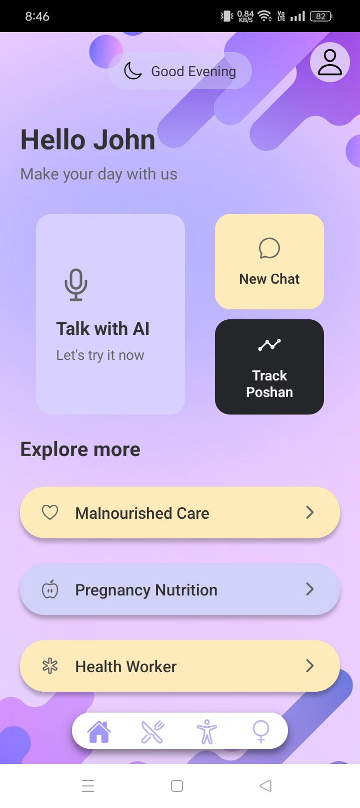
  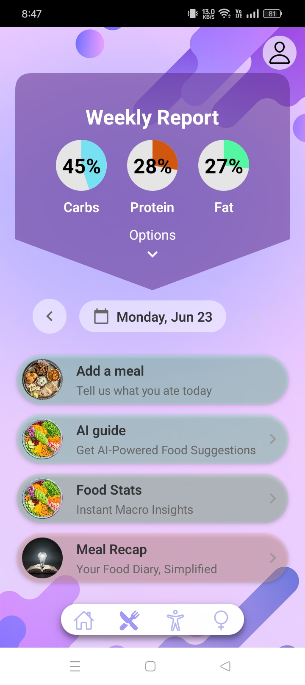
  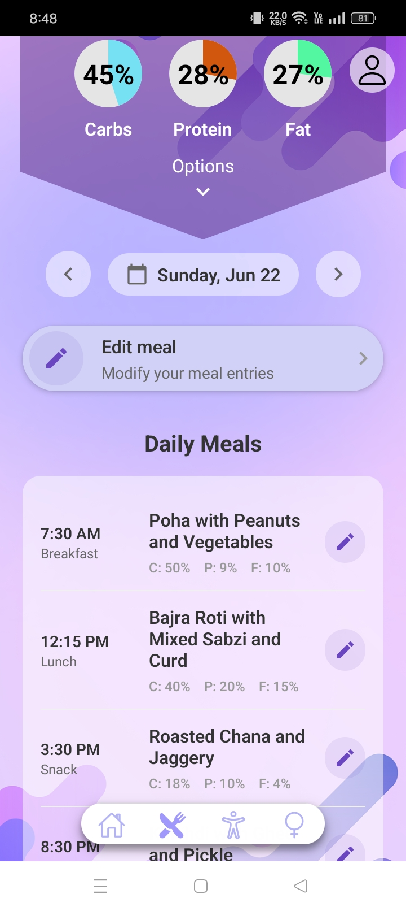
  
  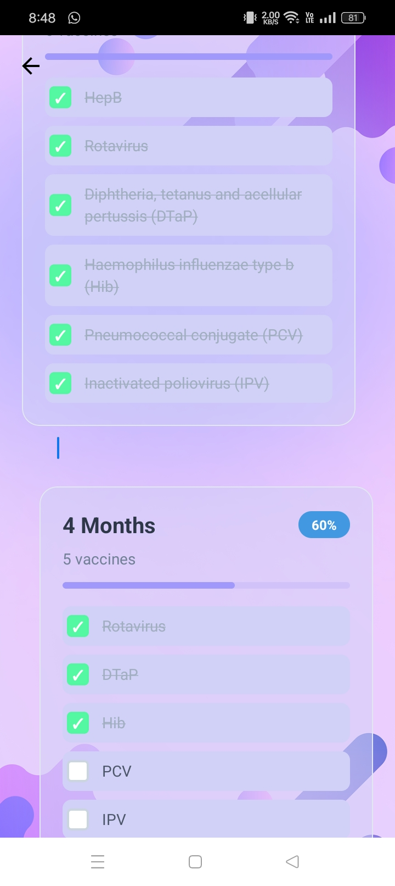
  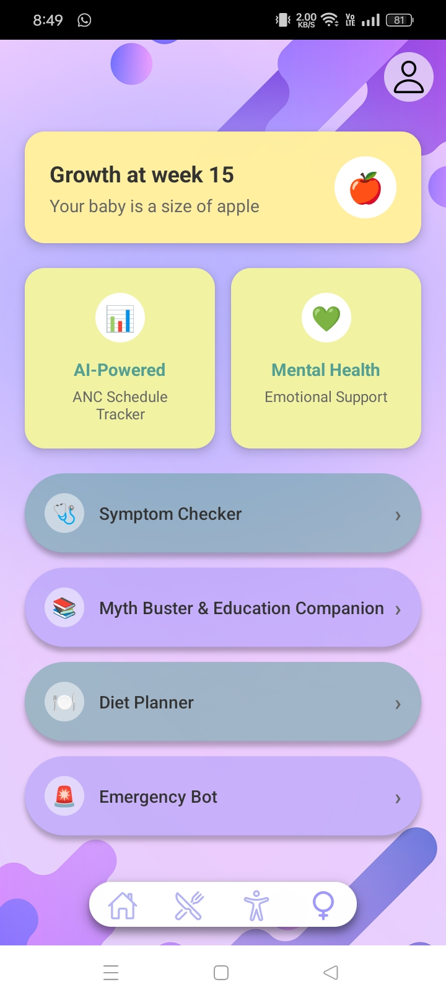
  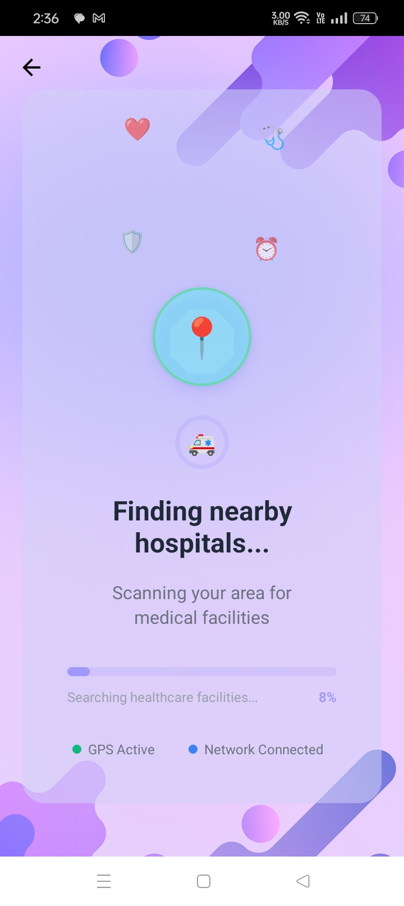
  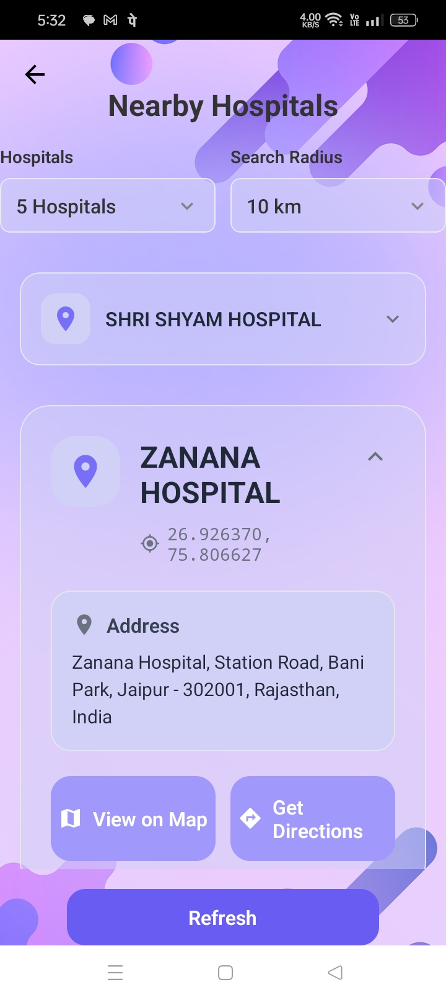
  
  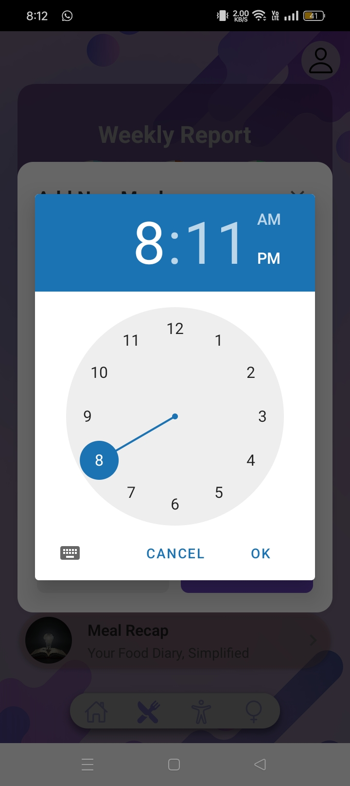
  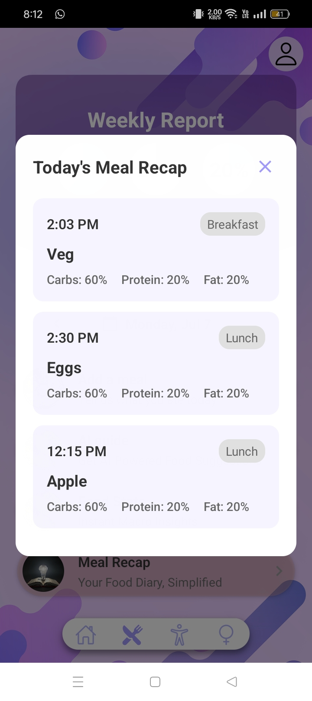
  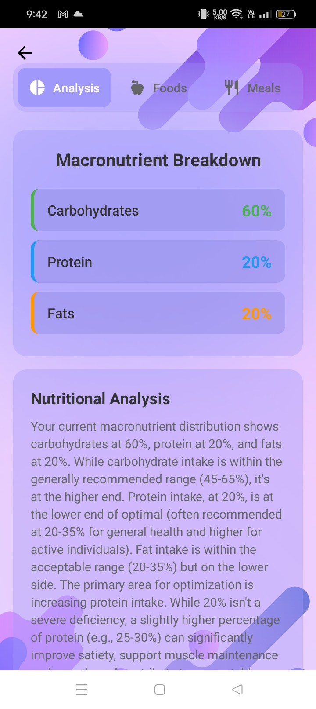
  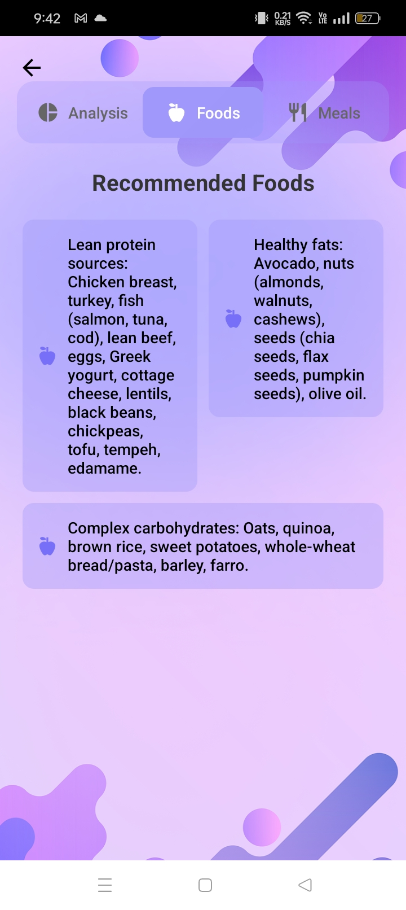
  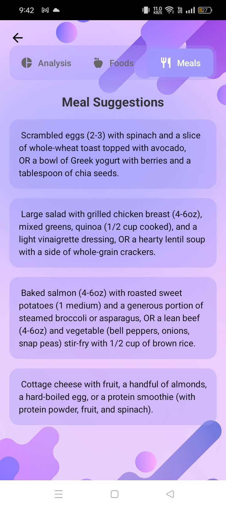
</p>
